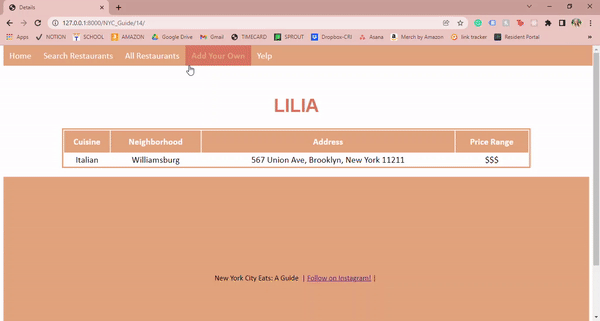
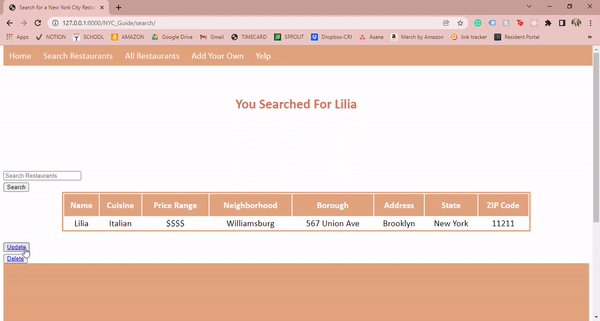
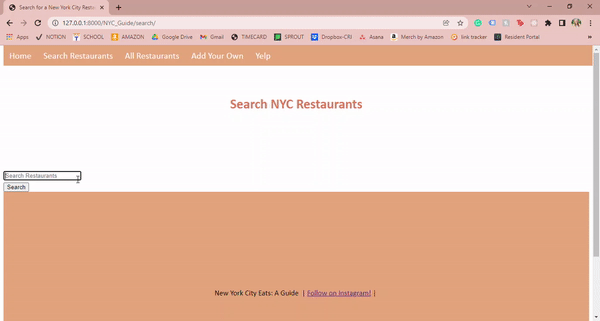
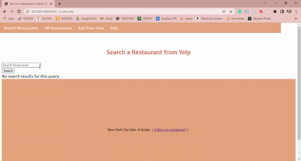

# Python Live Project
## Introduction
During my first live project in my boot camp, I created an interactive website using the Django framework. The topic I chose was "New York City Restaurants", as I live in Brooklyn and wanted to be able to put my passion for the incredible food scene to use in creating this site. To give the students a chance to understand how a real-world environment would feel like, we utilized Agile/Scrum Methodology. We had a sprint planning meeting, daily stand-ups, and code retrospectives at the end of each week. We were assigned stories  based on what task needed to be accomplished and learned how to succesfully merge into the master through Git. Throughout the project, I utilized my knowledge of Python, HTML, CSS, Javascript, and SQL. 

## CRUD Functionality
* **Create:** For my website, I created a model that contained information about New York City restaurants, including the name, borough, neighborhood, price range, and address. 

* **Read:** On my website, I wanted users to be able to see all the restaurants I had added to the database and then be able to click into them to view details. Below, you can see how that operates. [You can see the code snippet here.](#read) 

* **Update and Delete:** Users could also go into the details of the restaurant and update or delete the entry in the database. Below is an example of the update fuction, where I changed the price range of one of the restaurants in the database. [You can see the code snippet here.](#update-and-delete)

* **Additional Functionality:** I wanted users to be able to search a restaurant in the database as well. This was not a requirement of the project, but a feature I thought would add to my website. Below is an example of the use of a search bar. [You can see the code snippet here](#search-bar)

                    
## API

For the final section of this live project, I worked with the Yelp API to allow users to seearch outside of my database of restaurants. Using a search bar, the results displayed the restaurant they searched for, as well as similar other ones. It showed the phone number, rating, and current options for eating at the restaurant. Below is example of searching for a restaurant. [You can see a snippet of the code here.](#yelp-api)

### Read

The code below was put in views.py. The first function displays all the restaurants. The second function displays all the information on the restaurant on a separate page in a table.

            def all_rest(request):
              every_rest= Restaurants.Restaurants.all()
              context= {'every_rest': every_rest}
              return render(request, 'NYC_Guide/all_rest.html', context)

            def details(request, restaurants_id):
              rest_request= get_object_or_404(Restaurants, pk=restaurants_id)
              context= {'rest_request': rest_request}
              return render(request, 'NYC_Guide/details.html', context)
      

### Update and Delete

The code below was put into views.py. The first function allows users to update the restaurant they are viewing on the details page by clicking the "update" button. The second function allows a user to delete a restaurant. It takes them to a separate page to confirm deletion before it is removed from the database.

            def update_rest(request, restaurants_id):
                restaurant = get_object_or_404(Restaurants, pk=restaurants_id)
                form= RestaurantForm(request.POST or None, instance=restaurant)
                if request.method == "POST":
                    if form.is_valid():
                        form.save()
                        return redirect('all_rest')
                context= {'form': form, 'restaurant': restaurant}
                return render(request, 'NYC_Guide/update.html', context)

            def delete(request, restaurants_id):
                restaurant= get_object_or_404(Restaurants, pk=restaurants_id)
                form= RestaurantForm(request.POST or None, instance=restaurant)
                if request.method== "POST":
                    restaurant.delete()
                    return redirect('all_rest')
                context= {'form': form, 'restaurant': restaurant}
                return render(request, 'NYC_Guide/delete.html', context)

### Search Bar

The code below was put in views.py. It allows for users to search for a restaurant in the database and it pulls in all the information from the database that I deemed relevant for the search. 

            def search_rest(request):
                if request.method == "POST":
                    searched= request.POST['searched']
                    restaurants= Restaurants.Restaurants.filter(restaurant_name__contains=searched)
                    context= {'searched': searched, 'restaurants': restaurants}
                    return render(request, 'NYC_Guide/search.html', context)
                else:
                    return render(request, 'NYC_Guide/search.html', {})
                    
### Yelp API

The code below was put into views.py. It pulled information from the API and then allowed users to search through Yelp on my website. 

            def yelp(request):
                restname= ' '
                restaurants= []

                if 'restname' in request.POST:
                    restname= request.POST['restname']

                    api_key= '(hidden for security)'
                    headers = {'Authorization': 'Bearer %s' % api_key}

                    params = (
                        ('term', restname),
                        ('location', 'New York, NY'),
                        ('limit', '10')
                    )

                    url = "https://api.yelp.com/v3/businesses/search"
                    response = requests.get(url, headers=headers, params=params)
                    parsed= response.json()
                    rest_parsed=parsed['businesses']

                    for businesses in rest_parsed:
                        results= {
                            'name': businesses['name'],
                            'website': businesses['url'],
                            'display_phone': businesses['display_phone'],
                            'rating': businesses['rating'],
                            # 'price': businesses['price'],
                            'transactions': businesses['transactions'],
                            'id': businesses['id']
                        }
                        restaurants.append(results)
                context={'restaurants': restaurants}
                print(context)
                return render(request, 'NYC_Guide/yelp.html', context)
                
# Skills Acquired

Through this project, I was able to hone my skills in HTML, CSS, and Python while also learning how to use the Django framework. It was helpful for me to go through this process by using the Agile/Scrum methodology, as I now have an idea of what that will be like in my future roles. 
